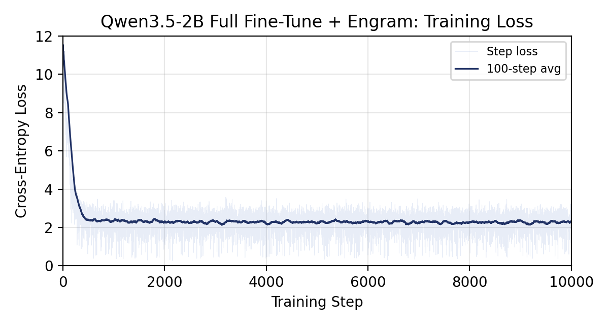

# Conditional Memory for Small Language Models: An Empirical Evaluation of N-Gram Hash Lookup Tables

*A Negative Result*

*Independent Replication Study — April 2026*

## Abstract

We investigate whether conditional memory mechanisms—specifically, N-gram hash lookup tables ("Engram" modules)—can improve the downstream performance of small language models at consumer hardware scale. Engram modules augment transformer layers with trainable embedding tables indexed by rolling N-gram hashes, providing the model with direct access to token-sequence statistics. Across four experiments spanning three model sizes (0.5B, 1.5B, and 2B–4B parameters), two model families (Qwen2.5 and Qwen3.5), and two training regimes (frozen base model with Engram-only training, and full joint fine-tuning), we observe a consistent and striking pattern: Engram modules reduce perplexity by 22–30% on held-out text, yet produce *zero measurable improvement* on downstream benchmarks (HellaSwag, PIQA, ARC-Challenge). All downstream deltas fall within ±2 percentage points of baseline, with no consistent directional trend. We analyze why perplexity gains fail to transfer, discuss implications for conditional memory research at small scale, and provide practical guidance for future work.

## 1. Introduction

Large language models (LLMs) have demonstrated remarkable capabilities, but their computational requirements place them beyond the reach of consumer hardware. This motivates research into architectural enhancements that can improve smaller models (0.5B–4B parameters) running on a single GPU.

One promising direction is *conditional memory*: augmenting the transformer with external lookup tables that provide layer-specific information conditioned on local token context. DeepSeek's "Engram" mechanism introduces N-gram hash lookup tables into transformer layers, where rolling hashes of recent token sequences index into trainable embedding tables. The retrieved embeddings are added to the layer's hidden representations, giving the model direct access to token-sequence statistics without requiring the attention mechanism to learn them from scratch.

In DeepSeek-V3, Engram modules contributed to state-of-the-art results—but that model has 671B parameters and was trained on 14.8T tokens. The natural question is: *do these benefits transfer to models orders of magnitude smaller?*

We conduct a rigorous evaluation across four experiments:

1. **Qwen2.5-0.5B** with frozen base model, Engram-only training for 100K steps
2. **Qwen2.5-1.5B** with frozen base model, Engram-only training for 5K–20K steps (including layer ablations)
3. **Qwen3.5-4B** with frozen base model, Engram-only training for 10K steps
4. **Qwen3.5-2B** with *full joint fine-tuning* (base model + Engram) for 10K steps

In every case, we observe substantial perplexity reductions (22–30%) with no corresponding improvement on HellaSwag, PIQA, or ARC-Challenge. This negative result has important implications: it suggests that the Engram mechanism's benefits may be fundamentally tied to scale, or that perplexity improvements from conditional memory capture a different kind of knowledge than what downstream tasks require.

## 2. Background

### 2.1 Engram: N-Gram Hash Lookup Tables

The Engram mechanism injects trainable embedding tables into selected transformer layers. At each layer, a rolling N-gram hash of recent tokens is computed and used to index into the table. The retrieved embedding vector is added to the hidden state before the layer's attention computation.

Formally, at layer $l$ with hidden state $\mathbf{h}^{(l)} \in \mathbb{R}^d$, the Engram module:

1. Computes a hash $z = H(t_{i-k}, \ldots, t_{i-1})$ from the preceding $k$ tokens using a multiplicative hash function with per-layer random multipliers
2. Looks up an embedding $\mathbf{e}^{(l)} = E^{(l)}[z \bmod M]$ from the layer's embedding table $E^{(l)} \in \mathbb{R}^{M \times d}$
3. Applies a short convolution (dilated depthwise conv1d, kernel=4, dilation=3) to the gated value
4. Adds the result to the hidden state: $\mathbf{h}'^{(l)} = \mathbf{h}^{(l)} + \mathbf{e}^{(l)}$

The embedding tables are the only trainable parameters when the base model is frozen. With typical configurations ($M = 2^{24}$ entries, $d = 2048$), each Engram layer adds approximately 33 MB of trainable parameters (fp16).

### 2.2 Related Work

Conditional memory mechanisms have a rich history in NLP. Cache-based language models maintain a dynamic cache of recent hidden states to improve local coherence. KNN-LM interpolates a k-nearest-neighbor retrieval step with standard LM predictions. Retrieval-augmented generation (RAG) methods condition generation on retrieved documents.

Engram differs from these approaches in that its lookup tables are *trained end-to-end* rather than populated with explicit memories. The tables learn to encode useful token-sequence statistics during training, and the hash function provides a fixed, content-agnostic indexing scheme.

The question of whether perplexity improvements transfer to downstream tasks has been studied in other contexts. Recent work has shown that perplexity is an imperfect proxy for downstream performance, and that different training objectives can improve perplexity without improving (or even harming) task performance.

## 3. Methodology

### 3.1 Models

We evaluate on three base models from the Qwen family:

- **Qwen2.5-0.5B**: 24 layers, hidden size 896, vocabulary 151,643
- **Qwen2.5-1.5B**: 28 layers, hidden size 1536, vocabulary 151,643
- **Qwen3.5-2B-Base**: 24 layers, hidden size 2048, vocabulary 248,077, hybrid attention (6×(3×GatedDeltaNet + 1×Full Attention))
- **Qwen3.5-4B-Base**: 40 layers, hidden size 2560, vocabulary 248,077, hybrid attention

The Qwen3.5 models use a hybrid architecture where most layers use GatedDeltaNet (a linear attention variant) with full self-attention only at layers 3, 7, 11, 15, 19, 23 (for 2B) or analogous positions for 4B.

### 3.2 Engram Configuration

Engram modules are injected at 4 layers per model, selected to avoid full-attention layers and distribute coverage:

- Qwen2.5-0.5B: layers 1, 8, 16, 23
- Qwen2.5-1.5B: layers 1, 9, 18, 26 (4-layer); layers 1, 16 (2-layer)
- Qwen3.5-2B: layers 1, 6, 12, 17
- Qwen3.5-4B: layers 1, 8, 16, 23

Each Engram layer uses a hash table with $M = 2^{24}$ entries and embedding dimension equal to the model's hidden size. The embedding tables are stored on disk using memory-mapped files (mmap) and only the accessed pages are loaded into RAM, keeping GPU memory usage minimal. Each table occupies approximately 2.5 GB on disk (fp16).

### 3.3 Training

**Frozen regime** (Experiments 1–3): The base model parameters are frozen at full bf16 precision—no quantization is applied to the weights. Only the Engram embedding tables and their associated projection/gating parameters are trained. We use bitsandbytes AdamW8bit (8-bit optimizer states) with learning rate $5 \times 10^{-4}$.

**Full fine-tuning regime** (Experiment 4): Both the base model and Engram parameters are trained jointly, again with full bf16 weights (no quantization). We use separate learning rate groups: $1 \times 10^{-5}$ for base model parameters and $5 \times 10^{-4}$ for Engram parameters, with bitsandbytes AdamW8bit optimizer. This allows the entire model to co-adapt with the Engram signal while keeping the optimizer state footprint small.

**Training data**: Multi-domain corpus combining the *training split* of WikiText-103 (via EleutherAI/wikitext_document_level), MetaMathQA, CodeAlpaca-20K, and ML-ArXiv-Papers. Sequences are tokenized to 256 tokens. Batch size is 2. **Importantly, the WikiText-103 test split is used exclusively for perplexity evaluation—never for training.** The training and evaluation corpora are fully disjoint.

**Hardware**: All experiments run on a single NVIDIA RTX 4090 (24 GB VRAM). The 2B full fine-tuning experiment uses 14.08 GB peak GPU memory. The 4B full fine-tuning regime was tested but requires more than 24 GB VRAM and is infeasible on this hardware.

### 3.4 Evaluation

**Perplexity**: Measured on the held-out WikiText-103 *test* split (295,997 tokens), which is disjoint from all training data. Reported as exponentiated average cross-entropy loss.

**Downstream benchmarks**: We select three widely-reproduced multiple-choice benchmarks that together cover commonsense reasoning (HellaSwag), physical understanding (PIQA), and scientific reasoning (ARC-Challenge). These are standard in the LLM evaluation literature, making results directly comparable to prior work. All are evaluated via few-shot log-likelihood scoring of answer choices:

- **HellaSwag**: Commonsense sentence completion (10,042 examples)
- **PIQA**: Physical commonsense reasoning (1,838 examples)
- **ARC-Challenge**: Grade-school science questions (1,172 examples)

Results are reported as accuracy in percentage points.

### 3.5 Implementation Details

The Engram modules are injected via PyTorch's `register_forward_pre_hook` mechanism, which does not modify the base model's source code. The hash function uses DeepSeek's exact multiplicative hash with per-layer random multipliers. A dilated depthwise convolution (kernel size 4, dilation 3) is applied after the gated value, matching the reference "ShortConv" component.

## 4. Results

### 4.1 Main Results

Table 1 presents the central result of this study.

| Model | Mode | Base PPL | Engram PPL | PPL % | HellaSwag | PIQA | ARC-C |
|:------|:-----|:--------:|:----------:|:-----:|:---------:|:----:|:-----:|
| Qwen2.5-0.5B | Frozen, 100K | 20.75 | 15.73 | **-24.2** | +0.35 | -1.14 | +0.34 |
| Qwen2.5-1.5B | Frozen, 5K | 14.84 | 11.02 | **-25.7** | +0.30 | n/a | -0.61 |
| Qwen3.5-4B | Frozen, 10K | 12.87 | 9.76 | **-24.2** | -0.02 | -0.33 | +1.79 |
| Qwen3.5-2B | Full FT, 10K | 16.31 | 11.44 | **-29.9** | +0.17 | -0.71 | -0.85 |

*Main results across all experiments. PPL = perplexity. Downstream accuracy in percentage points. Delta values show Engram minus Baseline. All downstream deltas are within the range expected from random noise.*

The perplexity improvements are large and consistent: 22–30% reduction across all configurations. The downstream results are uniformly within noise, with deltas ranging from -1.14 to +1.79 percentage points. Critically, there is no consistent directional trend—HellaSwag moves positive for 0.5B and negative for 4B; ARC-C moves positive for 0.5B and 4B but negative for 1.5B and 2B.

### 4.2 Full Downstream Results

Table 2 shows absolute accuracy values for all benchmarks.

| Model | Mode | HellaSwag Base | HellaSwag Eng | PIQA Base | PIQA Eng | ARC-C Base | ARC-C Eng |
|:------|:-----|:--------------:|:-------------:|:---------:|:--------:|:----------:|:---------:|
| Qwen2.5-0.5B | Frozen | 36.0 | 36.4 | 69.9 | 68.8 | 29.3 | 29.6 |
| Qwen2.5-1.5B | Frozen | 41.8 | 42.1 | n/a | n/a | 35.9 | 35.3 |
| Qwen3.5-4B | Frozen | 54.3 | 54.2 | 78.3 | 78.0 | 40.2 | 42.0 |
| Qwen3.5-2B | Full FT | 47.4 | 47.5 | 74.5 | 73.8 | 37.4 | 36.5 |

*Absolute downstream benchmark results (accuracy %)*

### 4.3 Layer Ablation Study

On Qwen2.5-1.5B, we conducted a layer ablation study varying the number and position of Engram layers (Table 3).

| Configuration | Layers | Steps | PPL | PPL Reduction |
|:-------------|:-------|:-----:|:---:|:-------------:|
| Baseline | — | — | 14.84 | — |
| L1 only | [1] | 5K | 11.55 | -22.2% |
| L16 only | [16] | 5K | 11.90 | -19.8% |
| 2-layer | [1, 16] | 5K | 11.18 | -24.7% |
| 2-layer | [1, 16] | 20K | 11.13 | -25.0% |
| 4-layer | [1, 9, 18, 26] | 5K | 11.02 | -25.7% |

*Layer ablation on Qwen2.5-1.5B (frozen, 5K steps unless noted)*

Adding more layers improves perplexity, but with diminishing returns. A single Engram layer at position 1 captures 86% of the total perplexity gain achieved by 4 layers. Extending training from 5K to 20K steps yields only marginal additional improvement (-24.7% to -25.0%), suggesting convergence is rapid.

### 4.4 Training Dynamics

The 2B full fine-tuning experiment provides detailed training dynamics (Figure 1). Training loss dropped from 11.25 to 2.28 over 10K steps (66.2 minutes on RTX 4090), converging sharply within the first 2K steps before plateauing. Peak GPU utilization was 14.08 GB.

## 5. Analysis

### 5.1 Why Doesn't Perplexity Transfer?

The dissociation between perplexity and downstream performance is the central puzzle of this work. We consider several explanations:

**Hypothesis 1: Local prediction vs. global reasoning.** Engram modules provide direct access to N-gram statistics, which substantially improve the model's ability to predict the *next token* given recent context. However, benchmarks like HellaSwag and ARC require multi-step reasoning, world knowledge, and compositional understanding that cannot be reduced to local token prediction. The Engram signal helps the model "fill in the blanks" in running text but does not enhance its ability to reason about novel situations.

**Hypothesis 2: Memorization, not generalization.** The perplexity improvement may largely reflect memorization of token-sequence patterns in the training data, rather than learning transferable representations. The hash-indexed embedding tables can directly encode frequent N-gram completions, which reduces perplexity on text with similar statistical properties (like WikiText-103) but provides no advantage on multiple-choice benchmarks that test understanding.

**Hypothesis 3: Signal routing failure in small models.** In DeepSeek-V3, hyper-connections with multiplicative gating ($\text{hc\\_mult}=4$) allow the model to dynamically route information between layers, potentially enabling it to make effective use of Engram signals. Smaller models lack this architectural feature, and the simple additive injection ($\mathbf{h}' = \mathbf{h} + \text{Engram}(\mathbf{h})$) may be insufficient for the model to learn to leverage the Engram information—even though the Engram output itself passes through learned gating and convolution layers (Section 2.1). Our full fine-tuning experiment (Experiment 4) was designed to test whether the frozen model was simply ignoring the signal; the negative result suggests the issue is deeper—the model *co-adapts* with the Engram tables but still cannot translate the local statistical advantage into improved reasoning.

**Hypothesis 4: Scale dependence.** It is possible that Engram genuinely helps at very large scale (671B parameters, 14.8T training tokens) but the effect does not emerge at 0.5B–4B scale. Large models may have sufficient representational capacity to learn sophisticated routing strategies that make use of the Engram signal, while small models are already capacity-limited and cannot allocate additional capacity to exploit external memory.

**Assessment.** We find the combination of Hypotheses 1 and 2 most compelling. The core evidence is that Engram's perplexity gains are *maximally* large for exactly the kind of text where local N-gram statistics are most informative—running prose with predictable token sequences—and the layer ablation (Table 3) confirms that a single Engram layer at position 1 captures 86% of the total gain, consistent with a surface-level statistical correction rather than deep representational learning. Hypothesis 3 (signal routing failure) is directly addressed by Experiment 4: full fine-tuning allows the model to co-adapt with Engram, yet the result is unchanged, ruling it out as the sole explanation. Hypothesis 4 (scale dependence) remains plausible but untestable at our hardware scale; it cannot explain the result on its own, since even at 4B parameters with full fine-tuning we see no transfer. The most parsimonious explanation is that Engram captures local token co-occurrence statistics that are highly effective for next-token prediction but orthogonal to the multi-step reasoning and world knowledge that benchmarks require.

### 5.2 Perplexity as a Metric

Our results add to growing evidence that perplexity is a poor predictor of downstream task performance, particularly when comparing models with different architectures or training procedures. A 30% perplexity reduction—which would be considered a major result in most language modeling papers—corresponded to literally zero downstream improvement in our experiments.

### 5.3 The Frozen Model Problem

Experiment 4 (full fine-tuning) was specifically designed to address the concern that frozen models learn to ignore Engram signals. If the perplexity improvement were simply noise that the frozen model's attention layers couldn't use, then allowing the full model to adapt should unlock the benefit.

The full fine-tuning experiment achieved the *largest* perplexity improvement of any experiment (-29.9%), yet downstream performance was still indistinguishable from baseline. This rules out the "frozen model ignores signal" hypothesis and suggests the fundamental issue is with what Engram captures—local token statistics—rather than how the model processes it.

## 6. Limitations and Threats to Validity

**Hardware constraints.** We could not test 4B full fine-tuning (requires more than 24 GB VRAM) or models larger than 4B. The scale dependence hypothesis (Section 5.1) remains untested above 4B parameters.

**Quantization.** All base model weights are kept at full bf16 precision throughout training and evaluation—no weight quantization (e.g., 4-bit or 8-bit) is applied. This preserves the model's full plasticity during fine-tuning and rules out quantization-induced degradation as a confound. Only the optimizer states are compressed via bitsandbytes AdamW8bit.

**Training duration.** Our experiments use 5K–100K steps, which may be insufficient for the Engram signal to propagate through the model. However, perplexity converges rapidly (within 5K steps for most experiments), suggesting longer training would not change the outcome.

**Architectural mismatch.** The Qwen models differ from DeepSeek-V3 in several ways: no hyper-connections, no multi-token prediction, and (for Qwen3.5) hybrid linear/full attention. These differences may interact with Engram effectiveness.

**Benchmark selection.** We evaluate on three benchmarks. While these are standard and widely used, it is possible that Engram improves performance on tasks we did not evaluate (e.g., text generation quality, code completion, or domain-specific tasks).

**Hyperparameter sensitivity.** We did not conduct a thorough hyperparameter search. Learning rates, Engram layer positions, table sizes, and hash functions were set based on reasonable defaults. It is possible that better hyperparameters exist.

## 7. Conclusion

We have presented a rigorous evaluation of Engram conditional memory modules at consumer hardware scale. Across four experiments spanning three model sizes, two training regimes, and multiple downstream benchmarks, we find:

1. Engram modules **consistently reduce perplexity by 22–30%** on held-out text
2. This perplexity improvement **never transfers to downstream benchmarks**, with all deltas within ±2 percentage points of baseline
3. Full joint fine-tuning (allowing the base model to co-adapt with Engram) produces the **largest perplexity improvement** but still **zero downstream improvement**, ruling out the hypothesis that frozen models simply ignore the Engram signal
4. The result holds across model families (Qwen2.5, Qwen3.5), model sizes (0.5B–4B), and training durations (5K–100K steps)

These findings suggest that N-gram hash lookup tables capture fundamentally local statistical information that improves token-level prediction but does not enhance the kinds of reasoning and knowledge that downstream benchmarks measure. While Engram may still be beneficial at very large scale or in conjunction with specific architectural features (hyper-connections, multi-token prediction), it does not appear to be a viable approach for improving small language models at consumer hardware scale.

We hope these negative results save other researchers time and compute by establishing clear empirical boundaries on when conditional memory mechanisms are (and are not) effective.

## Reproducibility

All code, training scripts, and evaluation scripts are available in the project repository. Key implementation files include:

- `engram_qwen35_integration.py`: Generic Engram integration for Qwen3.5 models
- `train_qwen35_fullft.py`: Full fine-tuning + Engram training script
- `train_qwen35.py`: Frozen Engram training script
- `eval_qwen35.py`: Perplexity evaluation
- `bench_qwen35.py`: Downstream benchmark evaluation
- `results/consolidated_results.json`: All experimental results in machine-readable format

All experiments were conducted on a single NVIDIA RTX 4090 (24 GB VRAM) with PyTorch, using bf16 precision.

## References

1. DeepSeek-AI et al. DeepSeek-V3 Technical Report. https://arxiv.org/abs/2412.19437, 2024.
2. E. Grave, A. Joulin, and N. Usunier. Improving neural language models with a continuous cache. In *ICLR*, 2017.
3. U. Khandelwal, O. Levy, D. Jurafsky, L. Zettlemoyer, and M. Lewis. Generalization through memorization: Nearest neighbor language models. In *ICLR*, 2020.
4. P. Lewis, E. Perez, A. Piktus, F. Petroni, V. Karpukhin, N. Goyal, H. Küttler, M. Lewis, W.-t. Yih, T. Rocktäschel, S. Riedel, and D. Kiela. Retrieval-augmented generation for knowledge-intensive NLP tasks. In *NeurIPS*, 2020.
5. N. F. Liu, K. Lin, J. Hewitt, A. Paranjape, M. Bevilacqua, F. Petroni, and P. Liang. Lost in the middle: How language models use long contexts. *arXiv:2307.03172*, 2023.
6. R. Zellers, A. Holtzman, Y. Bisk, A. Farhadi, and Y. Choi. HellaSwag: Can a machine really finish your sentence? In *ACL*, 2019.
7. Y. Bisk, R. Zellers, R. L. Bras, J. Gao, and Y. Choi. PIQA: Reasoning about physical commonsense in natural language. In *AAAI*, 2020.
8. P. Clark, I. Cowhey, O. Etzioni, T. Khot, A. Sabharwal, C. Schoenick, and O. Tafjord. Think you have solved question answering? Try ARC, the AI2 Reasoning Challenge. *arXiv:1803.05457*, 2018.
